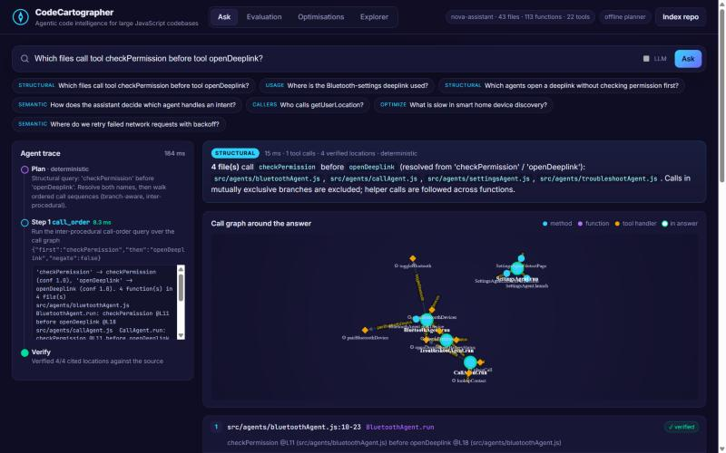
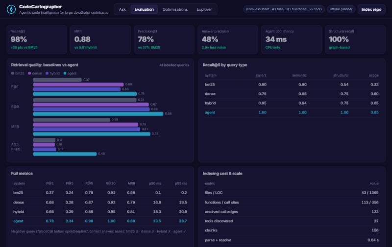
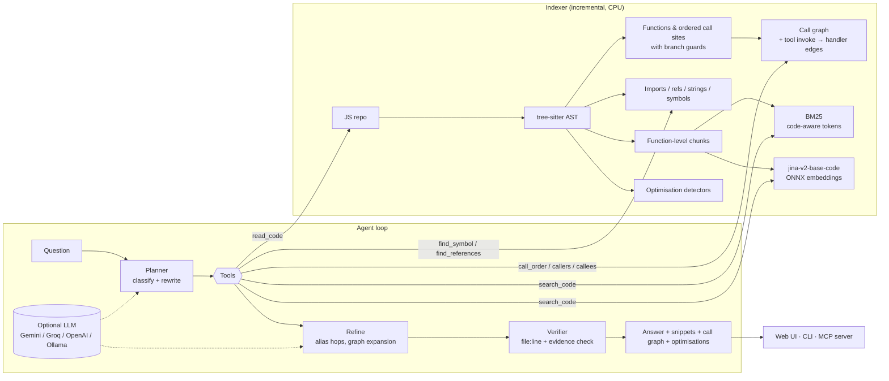

# 🧭 CodeCartographer

**Agentic code intelligence for JavaScript codebases far larger than any LLM context window.**

> Samsung PRISM GenAI Hackathon 2026 · **Theme 01 – Agentic Code Intelligence** · Team **SRM_SpaceX** (SRM Institute of Science and Technology): Adarsh Gupta, Aryan Sandilya, Ujjwal Pratap Singh

Ask a plain-English question → get the exact code snippets with **file and line numbers**, verified against the source.
CodeCartographer answers four kinds of questions:

| Query type | Example | How it's answered |
|---|---|---|
| **Semantic** | *"Where do we retry failed network requests with backoff?"* | Hybrid retrieval (BM25 + CPU code embeddings + symbols), multi-query rewrite, call-graph expansion |
| **Usage** | *"Where is the Bluetooth-settings deeplink used?"* | Symbol resolution → references → **2-hop alias tracking** through lookup tables |
| **Structural** | *"Which files call tool `checkPermission` before tool `openDeeplink`?"* | **Inter-procedural, branch-aware call-order analysis** over the AST call graph |
| **Callers / optimise** | *"Who calls getUserLocation?"*, *"What is slow in device discovery?"* | Call graph + 8 static performance detectors (bonus) |



---

## ✨ Highlights

- **Works agentically over a repo it can never fully see.** The agent plans, calls tools (`search_code`, `find_symbol`, `find_references`, `callers`, `call_order`, `read_code`, …), reads only exact spans and refines. It never loads whole files.
- **Correct structural answers instead of guesses.** "A before B" walks execution-ordered call sequences, follows helper methods across functions, and maps tool invocations (`registry.invoke('x')`) to their registered handlers. Calls in mutually exclusive `if/else`, ternary or `switch` arms are **never** reported as ordered.
- **Zero hallucinated locations.** A verifier re-checks every cited `file:line` against the source (file exists, lines in range, evidence present) before anything is shown.
- **CPU only.** tree-sitter parsing plus `jina-embeddings-v2-base-code` via ONNX (fastembed). No GPU, and **no API key needed**: the deterministic planner runs fully offline. Adding Gemini, Groq, OpenAI or a local Ollama key lets an LLM rewrite queries, call more tools and write the final answer.
- **Measured, not claimed.** An evaluation harness on 42 labelled queries reports precision@k, recall@k, MRR, latency and indexing cost for BM25, dense, hybrid and the agent, plus a scale benchmark.
- **Incremental indexing.** Unchanged files are not re-parsed and unchanged chunks are not re-embedded. Re-indexing an 860-file repo after one change takes **0.84 s**.
- **Plugs into your IDE.** A built-in **MCP server** lets Claude Code, Cursor or VS Code use it as a tool.
- **Bonus: optimisation suggestions** on the code paths it surfaces: await-in-loop / N+1, sync I/O on hot paths, regex compiled in loops, JSON deep-clones, O(n²) searches, tight polling and more.

---

## 📊 Results (CPU only, reproducible with `python -m eval.run_eval --scale 20`)

**Retrieval quality on 41 labelled queries** (+1 negative query) over the sample voice-assistant repo:

| system | P@1 | R@5 | R@10 | MRR | answer precision | p50 latency |
|---|---|---|---|---|---|---|
| BM25 (code-aware tokens) | 0.37 | 0.78 | 0.92 | 0.58 | 0.17 | 0.1 ms |
| Dense (jina code embeddings) | 0.68 | 0.87 | 0.93 | 0.79 | 0.16 | 17 ms |
| Hybrid (RRF fusion) | 0.66 | 0.88 | 0.95 | 0.81 | 0.17 | 18 ms |
| **CodeCartographer agent** | **0.78** | **0.98** | **1.00** | **0.88** | **0.48** | **34 ms** |

**Recall@5 by query type:**

| system | callers | semantic | structural | usage |
|---|---|---|---|---|
| BM25 | 0.90 | 0.90 | 0.54 | 0.33 |
| Dense | 0.75 | 0.98 | 0.75 | 0.60 |
| Hybrid | 0.95 | 0.94 | 0.75 | 0.65 |
| **Agent** | **1.00** | **1.00** | **1.00** | **0.85** |

- **Negative query** ("which files call `placeCall` before `openDeeplink`?", where the correct answer is *none* because the calls sit in exclusive branches): only the agent answers correctly.
- **Optimisation detectors:** precision 1.00, recall 1.00 on 12 expected findings.
- **Indexing cost (43 files):** parse 0.04 s, embedding 18 s on CPU, 1 MB index.
- **Scale (20× replicated repo: 860 files, 27K LOC, ≈237K tokens):** cold index 299 s (99% of it CPU embedding), **incremental re-index 0.84 s**, 22 MB index, **agent p50 49 ms / p95 129 ms**.



> "Answer precision" is the share of *everything returned* that is relevant, i.e. how much a developer has to read. The agent returns 2.8× less noise than the baselines.

---

## 🏗️ Architecture



More detail: [docs/ARCHITECTURE.md](docs/ARCHITECTURE.md).

---

## 🚀 Quick start

### Option A: Docker (recommended)
```bash
docker compose up --build
# open http://localhost:8000
```
To index **your own** repository:
```bash
REPO_PATH=/path/to/your/js/repo CARTO_REPO=/repo docker compose up --build
```

### Option B: Local Python (3.10+)
```bash
python -m venv .venv
.venv/Scripts/activate        # Windows  (Linux/macOS: source .venv/bin/activate)
pip install -r requirements.txt

python -m cartographer index sample_repo/nova-assistant      # first run downloads the 0.6 GB CPU model
python -m cartographer serve                                 # http://localhost:8000
```

### CLI
```bash
python -m cartographer ask sample_repo/nova-assistant "Which files call tool checkPermission before tool openDeeplink?" --code
python -m cartographer ask sample_repo/nova-assistant "Where is the Bluetooth-settings deeplink used?" --json
python -m cartographer search sample_repo/nova-assistant "retry with backoff" --mode dense
```

### Optional LLM (any one)
```bash
export GEMINI_API_KEY=...      # or GROQ_API_KEY / OPENAI_API_KEY
export CARTO_LLM=ollama        # or a fully local model via Ollama (qwen2.5-coder:7b)
```
Without a key the deterministic planner answers every query type. It is also what the evaluation uses, so the numbers are reproducible.

### MCP (Claude Code / Cursor / VS Code)
```bash
claude mcp add codecartographer -- python -m cartographer mcp /path/to/repo
```
Exposes `ask_codebase`, `call_order`, `search_code`, `find_references` and `read_code`.

### Evaluate & test
```bash
python -m eval.run_eval              # writes eval/results.json + eval/RESULTS.md
python -m eval.run_eval --scale 20   # + 20x scale benchmark
python -m eval.run_eval --llm        # + LLM-driven agent (needs a key)
python -m pytest -q                  # 15 tests
```

---

## 🧠 How the hard parts work

**1. Call order ("A before B").** The parser records every call in *evaluation order* (post-order, so arguments run before the outer call). Each call carries a *guard*: the list of `(branch-node, arm)` pairs it sits under. For each function the engine expands calls into their resolved callees (depth 3), including `registry.invoke('tool')` → the handler registered with `registry.register('tool', …)`. A match needs an `A` event before a `B` event whose guards are **not** mutually exclusive.
→ `SettingsAgent.run` is found through `ensurePermission()` → `launch()`.
→ `AccessibilityAgent` (opens the deeplink *then* checks permission) is correctly excluded.
→ `negate=true` answers *"which agents open a deeplink **without** checking permission first?"*.

**2. Usage with alias tracking.** `find_symbol` scores identifiers, constants, object keys, tool names and string literals. It combines name-part coverage, precision and *path context* (the word "deeplink" in the question favours `deeplinks/deeplinkConstants.js`). `find_references` then collects identifier, member-expression (`DEEPLINKS.BLUETOOTH_SETTINGS`) and string-literal uses. When a use sits inside a module-level table (`PROBLEM_TO_SETTINGS`, `SETTINGS_ALIASES`), the agent follows that table one more hop. This finds `TroubleshootAgent.run` and `SettingsAgent.detectPage`, which never mention the constant by name.

**3. Hybrid retrieval.** Function-level chunks are scored by BM25 (camelCase/snake-aware tokens), cosine similarity of `jina-embeddings-v2-base-code` vectors, and a symbol channel. The scores are fused with weighted Reciprocal Rank Fusion, then re-scored with light structural features. The agent adds code-vocabulary rewrites (synonyms offline, LLM rewrites online) as extra channels, and expands the best hit along the call graph.

**4. Verification.** Every location must exist in the index, sit within the file's bounds, and contain its evidence term. LLM-proposed locations go through the same check, so a hallucinated path or line never reaches the user.

---

## 📁 Repository layout

```
cartographer/         core package
  parser.py           tree-sitter extraction (functions, ordered calls, guards, imports, refs)
  indexer.py          incremental index, call resolution, chunking, embeddings
  graph.py            call-order / callers / callees / neighbourhood queries
  retrieval.py        BM25 + dense + symbols, RRF fusion
  agent.py            planners, LLM refinement, verifier (streams events)
  tools.py            agent toolbox + query classifier
  optimizer.py        static performance detectors
  llm.py              Gemini / Groq / OpenAI / Ollama over plain HTTP
  server.py           FastAPI + SSE        cli.py   CLI        mcp_server.py   MCP stdio server
web/                  single-page UI (trace, verified snippets, call graph, eval dashboard)
eval/                 gold set (42 queries), harness, results
sample_repo/          "Nova" – sample JS voice-assistant codebase (agents, tools, deeplinks)
tests/                pytest suite
docs/                 architecture, demo script, presentation
```

---

## ⚠️ Limitations & next steps

- Call resolution is name- and import-based. Dynamic dispatch (computed property calls, DI containers) is resolved only when a name is globally unique. **Next:** type inference via the TypeScript compiler API, for both JS and TS.
- Branch guards cover `if/else`, ternary and `switch`. Early `return`s and `try/catch` paths are approximated.
- The sample repo is small. The scale benchmark replicates it to 860 files, and the provided Samsung codebase can be indexed directly (`Index repo` button or CLI).
- Cold embedding dominates indexing time on CPU (≈0.1 s/chunk). **Next:** a smaller code model or int8 quantisation, and embedding only public / changed functions first.
- **Worklet ideas:** PR-time "impact analysis" (which agents are affected by a change), a policy linter ("every deeplink must be preceded by a permission check") built on `call_order`, and IDE integration through MCP.

---

## 🏷️ Submission

Final judged commit is tagged **`PRISM_GENAI_HACKATHON_Y2026`**.

- Presentation: [`docs/SRM_SpaceX_Submission_ppt.pptx`](docs/SRM_SpaceX_Submission_ppt.pptx)
- Demo script: [`docs/DEMO_SCRIPT.md`](docs/DEMO_SCRIPT.md)
- Evaluation report: [`eval/RESULTS.md`](eval/RESULTS.md)
- AI disclosure: [`AI_DISCLOSURE.md`](AI_DISCLOSURE.md)

**Demo video:** _add YouTube / Drive link here_

License: MIT
